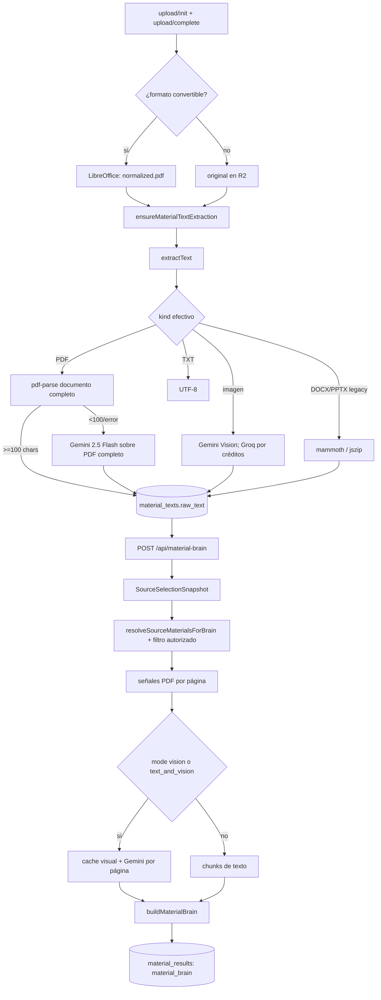
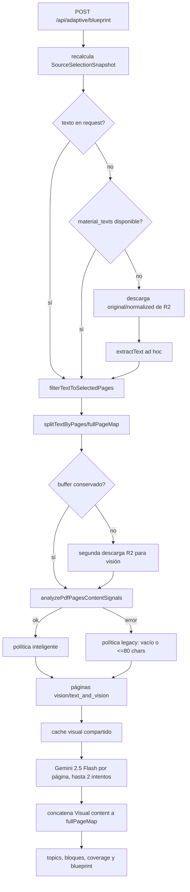
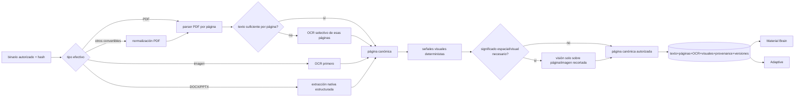

# Auditoría de ingestión de StudyAL

Fecha: 2026-08-26  
Alcance: auditoría estática, sin cambios de producto. Material Brain / modo libre y preparación/análisis del modo adaptativo.

## Resumen ejecutivo

El análisis académico/pedagógico adaptativo está **validado manualmente por el Product Owner, funciona bien y debe preservarse**. Esta auditoría no recomienda reemplazarlo por Material Brain ni unificar ambos análisis pedagógicos. La frontera potencialmente compartible es la capa anterior: ingestión, representación canónica, selección autorizada, OCR/visuales, fingerprints, cache y restore. Ninguna migración de esa frontera debe realizarse sin pruebas de equivalencia sobre materiales reales que demuestren que el analizador adaptativo recibe un corpus semánticamente equivalente al actual.

La hipótesis de uso visual prematuro queda **confirmada en la extracción canónica base**, pero no debe atribuirse al analizador pedagógico adaptativo:

1. Un PDF con texto nativo sí empieza correctamente con `pdf-parse`. Sin embargo, si el documento completo queda por debajo de 100 caracteres, el fallback efectivo no es OCR selectivo: se envía **el PDF completo** a OpenRouter con `google/gemini-2.5-flash`. Existe una implementación de Mistral OCR, pero no tiene ningún caller de producción.
2. Una imagen empieza directamente con Gemini Vision (y, solo por créditos agotados confirmados, Groq Vision). No existe una fase OCR-first separada.
3. DOCX/PPTX/ODT/RTF se normalizan a PDF con LibreOffice y después pasan por el pipeline PDF. Los extractores nativos `mammoth`/`jszip` sobreviven como fallback legacy, pero no son la autoridad estructurada primaria. Esto pierde estructura antes de extraerla y contradice el orden propuesto.
4. La visión **por página** está mejor acotada: ambos modos comparten `analyzePdfPagesContentSignals`, `decidePageAnalysisMode`, `selectPagesNeedingVisualAnalysis`, `analyzePdfPageVisual` y el cache visual. La política inteligente solo selecciona `vision` o `text_and_vision` según texto, tinta, imágenes, vectores, tablas y captions.
5. Antes de iniciar su análisis pedagógico, la ruta Adaptive conserva un pipeline paralelo: acepta texto del request, consulta `material_texts`, y si falta vuelve a descargar y ejecutar `extractText`. Material Brain exige/activa primero la extracción persistida y luego resuelve `material_texts`. El riesgo de reextracción y representaciones divergentes ocurre **antes** de `extractDocumentStructure`/`analyzeTopic`; no es un defecto demostrado de esos analizadores.
6. La autoridad está fragmentada entre: fila `materials`, fila `material_texts`, texto opcional del request adaptativo, PDF original/normalizado en R2, `SourceSelectionSnapshot`, fingerprint del contenido binario y cache visual. El fingerprint de selección no incluye contenido/versionado del material; el fingerprint visual sí deriva del PDF binario.

El cambio mínimo se revisa: primero instrumentar y hacer explícita una operación restore-first compartida que entregue al analizador adaptativo **exactamente el mismo texto paginado y enriquecimiento visual que recibe hoy**, sin cambiar sus prompts, chunking, auditoría, reparación, certificación ni consumidores. Solo después de probar equivalencia con materiales reales puede retirarse el fallback ad hoc. Un cambio aún menor y más seguro es persistir/reutilizar la extracción ad hoc exitosa y añadir identidad/versionado, evitando repetirla sin alterar todavía la representación de entrada.

## Diagrama de Material Brain / modo libre



Notas:

- El build rápido (`twoLevelReadiness`) calcula señales pero pasa `skipVisualAnalysis`; la llamada visual queda diferida a enriquecimientos posteriores.
- La visión por página descarga el PDF nuevamente desde R2 dentro de `prepareMaterialBrainMultimodalSources`; no reutiliza el buffer usado durante la extracción textual original, porque esa extracción ya ocurrió en otra frontera temporal.

## Diagrama del modo adaptativo



## Tabla comparativa

| Aspecto | Material Brain / libre | Adaptive | Diagnóstico |
|---|---|---|---|
| Entrada de ingestión durable | `upload/complete` → `ensureMaterialTextExtraction`; recuperación adicional en `POST /api/material-brain` | No posee entrada durable propia; `POST /api/adaptive/blueprint` puede leer, descargar y extraer | Adaptive mezcla preparación pedagógica con ingestión |
| Entrada de consumo | `POST /api/material-brain` | `POST /api/adaptive/blueprint` | Correctamente separables por pedagogía |
| Parser PDF | `pdf-parse` mediante `extractText` | `material_texts`; si falta, el mismo `extractText` | Parser compartido, uso no compartido |
| OCR PDF efectivo | Gemini 2.5 Flash vía OpenRouter, PDF completo | Igual si cae al extractor ad hoc | No es OCR selectivo; Mistral OCR está muerto |
| Imagen | Gemini Vision; Groq solo por créditos OpenRouter | La ruta blueprint no demuestra soporte equivalente directo para `kind=image` en la fase visual por página | No hay OCR-first |
| DOCX/PPTX | Normalización LibreOffice a PDF; mammoth/jszip legacy | Usa `normalized.pdf` cuando existe | Autoridad binaria común, pero sin extracción nativa estructurada primaria |
| Clasificación visual | `decidePageAnalysisMode` + política inteligente | Mismo clasificador; legacy si fallan señales | Buena pieza compartida; fallback legacy es más amplio |
| Proveedor visual por página | OpenRouter, Gemini 2.5 Flash | El mismo | Compartido correctamente |
| Cache visual | `material_results`, identidad SHA-256 del PDF+página+versiones+modelo | El mismo store e identidad | Compartido correctamente |
| Texto autorizado | `material_texts.raw_text` filtrado por unidades/páginas | request `text` o `material_texts` o extracción efímera, luego filtro | Adaptive mantiene autoridades alternativas |
| Identidad de sesión/fuente | fingerprint de `SourceSelectionSnapshot` | mismo fingerprint, validado contra claim del cliente | La selección es compartible; la sesión/pedagogía no debe serlo |
| Persistencia de resultado | Material Brain en `material_results` | blueprint/session en su dominio | Deben seguir separados |

## Activadores exactos de Vision

### Extracción base

- PDF: `pdf-parse` extrae todas las páginas. Se considera escaneado si el texto, sin marcadores, tiene **menos de 100 caracteres en todo el documento**. Si no es `localOnly`, existe `OPENROUTER_API_KEY` y el buffer es menor de 50 MiB, se envía el **PDF completo** a `google/gemini-2.5-flash` como archivo. Éste es el activador indiscriminado más importante.
- Imagen: cualquier `kind === 'image'` entra directamente en `extractImage`; llama Gemini Vision. Groq Vision solo se habilita cuando la política clasifica el fallo de OpenRouter como créditos agotados.
- Mistral: `extractWithMistralOcr` usa `mistral-ocr-latest`, pero no es llamado por `extractPdf` ni por otro símbolo de producción localizado.

### Visión selectiva por página

`decidePageAnalysisMode` calcula:

- `embeddedVisual`: imagen embebida y `rasterInkRatio >= 0.008`.
- `vectorVisual`: al menos 12 segmentos vectoriales, 3 operaciones de dibujo y tinta significativa.
- `coloredVisual`: color `>= 0.012`, densidad de bordes `>= 0.012` y tinta `>= 0.02`.
- Con contenido visual y texto ausente o `<= 80` caracteres significativos: `mode='vision'`.
- Con texto útil: solo `text_and_vision` si además existe señal de tabla o caption. Fórmulas por sí solas suman riesgo, pero no activan `text_and_vision`.
- Sin contenido visual: `mode='text'`, incluso si no hay texto.

Ambos modos llaman la política `intelligent`. Adaptive cae a la política `legacy` si falla la inteligencia de página; ésta selecciona páginas vacías o con `<=80` caracteres limpios. Material Brain, ante fallo de inteligencia, registra error de preparación y no ejecuta ese fallback legacy.

El proveedor visual por página recibe el PDF completo codificado como `image_url`, aunque el prompt dice “Analyze ONLY page N”. La selección es por página, pero el payload no es una imagen recortada/rasterizada de esa página. Esto necesita verificación real contra el comportamiento de OpenRouter/Gemini.

## Autoridades duplicadas

| Dato | Autoridad actual observada | Duplicación/conflicto |
|---|---|---|
| Binario de estudio | `normalized_storage_key || storage_key` | Conviven original y PDF normalizado; correcto si el resolver es único |
| Tipo de estudio | `normalized_kind || kind` | `kind` sigue siendo formato de presentación; callers ad hoc pueden usar el equivocado |
| Texto | `material_texts.raw_text` debería ser canónico | Adaptive también confía en `body.materials[].text` y en extracción efímera no persistida |
| Estado de texto | `materials.text_status` | Adaptive no lo usa como gate restore-first antes de reextraer |
| Páginas autorizadas | `SourceSelectionSnapshot.selectedPages` | Adaptive reconstruye mapas intermedios; el filtro es canónico, pero una selección vacía conserva “documento completo” legacy |
| Fingerprint de selección | hash de IDs+páginas en `SourceSelectionSnapshot` | No incluye hash/version del contenido; mismo ID+páginas tras reemplazo de contenido mantiene identidad |
| Fingerprint de contenido visual | SHA-256 del PDF binario | Separado correctamente del fingerprint de selección, pero no existe un manifiesto único que los vincule |
| OCR/procedencia textual | `ExtractionResult.method` solo existe durante extracción | `saveMaterialText` persiste únicamente `raw_text`; pierde method, clasificación, OCR, páginas y versión del extractor |
| Visuales | `material_results` tipo `visual_page_analysis` | Se fusionan como chunks/evidencia en Brain y como texto concatenado en Adaptive; dos representaciones derivadas legítimas, sin una representación canónica de página multimodal compartida |
| Resultado pedagógico | Brain vs blueprint/session adaptativa | Debe permanecer separado; no es duplicación a eliminar |

## ¿Se vuelve a extraer el mismo documento?

Sí, hay tres escenarios:

1. Adaptive ejecuta `extractText` si el request y `material_texts` no tienen texto. Esa extracción no se guarda en `material_texts`, por lo que una petición posterior puede repetirla.
2. `upload/complete` convierte DOCX/PPTX y después evalúa `resolveStudyKind(material)` sobre el objeto `material` previo a la conversión. Como ese objeto no se refresca con `normalized_kind='pdf'`, puede no iniciar la extracción del PDF normalizado en esa misma petición. Otro endpoint (`units`, Material Brain o Adaptive) la inicia o la realiza después.
3. Adaptive conserva el buffer cuando tuvo que extraer; si el texto vino del request/DB, vuelve a descargar el PDF para análisis visual. No repite necesariamente el parsing, pero sí la lectura binaria.

`ensureMaterialTextExtraction` deduplica solo dentro del proceso mediante `inFlight` por `material.id` y respeta texto ya persistido/estado reciente. No existe prueba en este alcance de un lease distribuido para extracción textual entre instancias.

## Responsabilidades duplicadas

- Resolución de material, tipo efectivo, storage key y texto: `resolveSourceMaterialsForBrain` frente al bloque inline de `adaptive/blueprint`.
- Restore-first y fallback de extracción: encapsulado en `ensureMaterialTextExtraction` para Brain, reimplementado parcialmente en Adaptive.
- Descarga del PDF: extracción durable, multimodal de Brain y ruta Adaptive.
- Construcción de texto por página: filtros/splitters en selección canónica, chunking de Brain y helpers internos de blueprint.
- Fusión texto+visual: evidencia/chunks en Brain frente a concatenación `[Visual content]` en Adaptive.
- Clasificación y cache visual **no están duplicados**: ya son infraestructura compartida adecuada.

## Piezas compartibles sin unir pedagogías

1. `resolveCanonicalMaterialCorpus(userId, SourceSelectionSnapshot)`: ownership, tipo/storage efectivos, estado de conversión/texto, restore-first y filtro autorizado.
2. Un manifiesto persistido de extracción: versión, método, clasificación, hash binario, conteo de páginas y procedencia OCR.
3. Extracción por página normalizada: texto nativo/OCR y estado de cada página.
4. `pageContentSignals`, decisión visual, cache visual y evidencia multimodal, que ya están compartidos.
5. Descarga/cache del buffer por request/build, sin compartir identidad de sesión.

Deben permanecer separados: unidades/relaciones del Brain, blueprint adaptativo, coverage/mastery, progreso, restore de sesiones y artefactos pedagógicos.

## Hallazgos P0–P3

### P0

- **Autoridad textual múltiple antes del análisis Adaptive.** La ruta puede construir el corpus desde texto suministrado por el cliente o desde una extracción efímera no persistida, mientras Material Brain usa `material_texts`. Esto permite que los analizadores reciban representaciones distintas del mismo material y debilita restore-first/source authority. No es evidencia de un defecto en el análisis pedagógico adaptativo una vez recibido el corpus.

### P1

- **Vision como OCR de PDF completo.** Menos de 100 caracteres globales dispara Gemini sobre todo el PDF; no hay OCR selectivo por página.
- **Imágenes usan visión como primer extractor.** No existe OCR-first separado antes de interpretación visual.
- **Mistral OCR muerto.** El comentario anuncia “Mistral OCR → Gemini”, pero el único fallback conectado es Gemini.
- **Conversión y extracción no forman una transición atómica.** `upload/complete` no refresca el material tras convertir; puede aplazar la extracción del PDF normalizado.
- **Fingerprint de selección sin versión de contenido.** IDs+páginas no distinguen un binario reemplazado bajo el mismo material.

### P2

- **DOCX/PPTX pierden su estructura nativa como camino primario.** Se convierten a PDF antes de extraer; mammoth/jszip son fallback legacy y además extraen texto plano, no un AST estructurado rico.
- **Fallback visual divergente.** Adaptive usa selección legacy cuando falla el analizador; Brain declara preparación visual no disponible. La misma falla produce distinta cobertura multimodal.
- **Payload visual no recortado.** Se manda el PDF entero en cada análisis de página; puede incrementar costo y riesgo de analizar la página equivocada.
- **Metadatos de extracción no persistidos.** `method`, `classification`, `isImageBased` y versión desaparecen al guardar solo `raw_text`.

### P3

- `extractImage` mezcla OCR, transcripción de fórmulas y análisis semántico en un único prompt/proveedor.
- `isImageBased` significa “vino de visión”, no “el material/página es escaneado”; el nombre puede inducir decisiones incorrectas.
- La ruta Adaptive concentra ingestión, visión, estructura, auditoría y generación en un único módulo de 2.014 líneas.

## Pipeline canónico propuesto



Orden recomendado:

1. Restaurar manifiesto/texto válido por hash y versión.
2. PDF: parser nativo por página.
3. Solo páginas sin texto suficiente: OCR.
4. Imagen: OCR primero; interpretación visual después si las señales lo justifican.
5. DOCX/PPTX: extracción estructurada nativa; PDF normalizado puede mantenerse para visualización y fallback.
6. Visión solo para gráficas, diagramas, tablas complejas, fórmulas visuales o relaciones espaciales que texto/OCR no capturen.
7. Persistir una página canónica con capas `native_text`, `ocr_text`, `visual_description`, procedencia y fingerprints; los modos consumen esa autoridad con su propia pedagogía.

## Primer cambio mínimo

La recomendación anterior —“eliminar la extracción ad hoc de Adaptive y exigir texto canónico persistido”— era correcta como dirección de frontera, pero demasiado absoluta como primer paso. “Extracción ad hoc” significa únicamente el bloque previo al análisis en `app/api/adaptive/blueprint/route.ts` que, ante ausencia de `m.text` y `material_texts`, ejecuta `downloadFromR2(...) → extractText(...)` y conserva opcionalmente ese `buffer`. **No** significa retirar ni reemplazar:

- `extractDocumentStructure`;
- `analyzeTopic` y sus retries/chunking;
- normalización/consolidación de topics, blocks y concepts;
- `auditBlueprint`;
- `repairCoverageGaps`;
- `certifyBlueprint`;
- `evaluateBlueprintQuality`/`enrichBlueprintHeuristics`;
- `buildLearningJourney`, generación de sesiones, enseñanza, evaluación o recuperación adaptativa.

Retirar inmediatamente el fallback puede alterar calidad o disponibilidad si `material_texts.raw_text` no es semánticamente equivalente al texto que Adaptive recibe hoy, si pierde marcadores de página, si el texto del request contiene una versión más completa, o si el enriquecimiento visual llega en otro orden/formato. Por tanto, el primer cambio revisado es:

1. Definir un resolver de corpus canónico compartido que produzca un **adaptador de compatibilidad Adaptive** con el mismo contrato observable actual: texto por página, orden, selección, marcadores, texto visual fusionado y metadatos/fingerprint.
2. Ejecutarlo inicialmente en shadow/compare, sin cambiar el input de producción del analizador.
3. Solo con equivalencia demostrada, sustituir en la ruta el bloque `m.text → getMaterialText → download/extract` por el resolver y retirar la rama ad hoc.

Cambio todavía más pequeño y seguro: cuando Adaptive tenga que usar su fallback actual, persistir idempotentemente su resultado en `material_texts` junto con método/hash/versión, o delegar esa obtención a `ensureMaterialTextExtraction`, pero conservar por ahora el mismo texto final, el mismo `fullPageMap` y todo el análisis posterior. Esto reduce repetición sin cambiar la pedagogía.

Pruebas obligatorias antes de aplicar la sustitución:

- golden comparison del texto paginado y `fullPageMap` antes/después;
- mismas páginas autorizadas y cero fuga de páginas no seleccionadas;
- paridad de topics, roles, blocks, source spans, importance, difficulty, Bloom, exam types y misconceptions;
- paridad de `coverageCertified`/`planGenerationAllowed` y razones de certificación;
- comparación del journey y distribución de sesiones derivados;
- sesiones reales de enseñanza/evaluación equivalentes, incluidas fórmulas, tablas, diagramas y documentos escaneados;
- restore cross-device sin regeneración;
- materiales reales ya validados manualmente por el Product Owner, además de contratos sintéticos.

## Comparación Material Brain vs análisis adaptativo

### A. Entradas

#### Material Brain

La entrada externa es `SourceSelectionSnapshot` (1–5 materiales, páginas por material y fingerprint). `resolveSourceMaterialsForBrain` la convierte en `ResolvedSourceMaterial[]` con:

- `materialId`, nombre y `kind` efectivo;
- texto autorizado ya filtrado a páginas/unidades seleccionadas;
- `knownPages` cuando la selección es explícita;
- `storageKey` solo para PDFs que pueden necesitar análisis visual.

`buildMaterialBrain` transforma esa representación en `PageChunk[]`. Cada chunk contiene `materialId`, páginas, orden, texto y `sourceKind: text|vision`; los chunks visuales pueden llevar `SourceEvidence`. El extractor pedagógico real, `extractChunk`, recibe **un chunk cada vez**, no el archivo original ni una imagen. Si es textual, el prompt exige citas literales y página; si es visual, recibe una descripción visual ya verificada y la provenance se adjunta externamente.

Material Brain puede operar correctamente sin Vision: su fast path marca el contenido textual como source-ready con cero llamadas visuales, y la visión es cobertura opcional/diferida. Su profundidad será menor en páginas cuyo significado dependa de diagramas o disposición espacial, pero el contrato distingue esa brecha mediante `visualCoverage`/`optionalGaps`.

#### Análisis adaptativo

La entrada externa de `POST /api/adaptive/blueprint` contiene materiales con `materialId`, nombre, `selectedPages` y opcionalmente `text`, además de un fingerprint reclamado. Antes del análisis, la ruta construye:

- `SourceSelectionSnapshot` canónico;
- texto filtrado a páginas seleccionadas;
- `pageMap` y `fullPageMap` indexados por número de página;
- opcionalmente un buffer PDF para señales visuales;
- descripciones visuales exitosas concatenadas a la página como `[Visual content]`;
- nombre del material, orden/posición de topic, rol de sección e idioma inferido.

`extractDocumentStructure` recibe muestras de texto por página y produce topics/roles. `analyzeTopic` recibe texto completo por topic, lo divide con overlap y produce bloques pedagógicos ricos. No recibe OCR como tipo separado: recibe el texto resultante, cualquiera que haya sido su método. Tampoco recibe imágenes directamente: Vision ocurre antes y se incorpora como texto.

Adaptive puede operar sin Vision cuando las páginas contienen texto suficiente y `decidePageAnalysisMode` devuelve `text`, o cuando no hay buffer PDF. Sin embargo, si una página fue clasificada como visualmente requerida y el enriquecimiento falla, `certifyBlueprint` bloquea coverage/plan; por diseño, la capacidad de operar sin Vision depende del corpus, no solo del analizador.

### B. Responsabilidades y consumidores

Material Brain produce una base de conocimiento durable y reusable:

- `KnowledgeUnit[]` tipadas (concept, fact, definition, formula, process, example, event/data, terminology);
- `KnowledgeRelation[]` tipadas;
- identidad semántica, qualifiers, importance y provenance literal;
- source/visual coverage, telemetría, checkpoints, merge log y estado de enriquecimiento.

La consumen herramientas libres: chat, análisis teórico, mapa de estudio, quizzes, flashcards, exámenes, repaso y “truquitos”, mediante context builders y stores propios. También sirve como autoridad reusable para grounding, deduplicación, cobertura y restore de artefactos libres.

El análisis adaptativo produce un blueprint pedagógico ordenado y certificado:

- topics naturales con rol documental;
- bloques con resumen, importancia, dificultad, Bloom, exam types, exam probability, tiempo, dependencias, relaciones, misconceptions y source spans;
- índice consolidado de conceptos y orden global;
- métricas de cobertura;
- auditoría independiente, reparación de huecos y certificación que autoriza/bloquea el plan.

Lo consumen `StudyALAdaptive`, `adaptive/generate-plan`, `buildLearningJourney` y, transitivamente, la preparación de sesiones, enseñanza, evaluación, reteaching/recovery, scoring/mastery y UI de progreso.

Responsabilidades realmente equivalentes:

- segmentar texto en unidades analizables;
- extraer conceptos/definiciones/fórmulas/hechos/ejemplos;
- representar relaciones/dependencias;
- conservar referencia a páginas/fuente;
- medir cobertura y evitar invención.

Responsabilidades parecidas con objetivos distintos:

- Importance de Brain prioriza una base reusable para herramientas; Adaptive añade probabilidad de examen, dificultad, Bloom y tiempo para secuenciar enseñanza.
- Relaciones de Brain forman un grafo de conocimiento estable; Adaptive usa dependencias/relaciones dentro de un orden global y topics para construir journey/sesiones.
- Coverage de Brain mide procesamiento/extracción del corpus; certificación Adaptive decide si existe un mapa suficientemente completo para planificar.
- Chunking de Brain busca extracción exhaustiva y deduplicable; topics/chunking Adaptive preservan estructura documental y objetivos de aprendizaje.

### C. Calidad y capacidades que deben preservarse

Capacidades adaptativas respaldadas por código/contratos y por validación manual del Product Owner:

- detección de estructura natural sin imponer un topic por página;
- roles `foundation/problem/mechanism/application/integration/context`;
- análisis por topic con contexto de las demás secciones;
- preservación explícita de modalidad (hecho frente a opinión/argumento);
- bloques pedagógicos finos, no un resumen único;
- Bloom, dificultad, probabilidad/tipos de examen, misconceptions y tiempo estimado;
- retries escalonados y división de chunks para recuperación;
- consolidación de topics/conceptos y orden global;
- auditoría separada de omisiones/invenciones;
- reparación dirigida de huecos;
- certificación determinista que bloquea planes no confiables;
- vínculo directo con journey, sesiones, enseñanza, evaluación y recovery.

Capacidades adicionales útiles de Material Brain para modo libre:

- identidad semántica y qualifiers para deduplicación durable;
- citas literales obligatorias y validación de provenance;
- relaciones tipadas y merge log;
- checkpoints por chunk/subchunk, restore y enriquecimiento incremental;
- cobertura separada de visuales;
- una autoridad compartida por muchas herramientas libres;
- planners/artefact stores especializados para quizzes y flashcards.

Duplicación de menor profundidad que sí puede afirmarse: Material Brain extrae tipos básicos de conocimiento y relaciones que Adaptive también expresa dentro de bloques/conceptos. No hay evidencia suficiente para declarar que su extracción sea globalmente “inferior”; posee contratos más fuertes de provenance/identidad en varios puntos. Sí es demostrable que su esquema base no contiene campos pedagógicos equivalentes a `bloomLevel`, `examProbability`, `examTypes`, `difficulty`, `misconceptions`, `estimatedMinutes` ni roles de topic. Por tanto, no sustituye funcionalmente al blueprint adaptativo.

### D. Extracción frente a análisis

| Clase de problema | Evidencia | Pertenece al analizador pedagógico |
|---|---|---|
| Extracción/ingestión | umbral PDF global `<100`, Gemini sobre PDF completo, imagen Vision-first, Mistral OCR desconectado, conversión no refrescada | No |
| Clasificación visual | heurísticas de señales; fallback legacy de Adaptive; payload PDF completo por página | No: ocurre antes de topics/chunks pedagógicos |
| Persistencia/restore | texto del request, `material_texts` o extracción efímera; metadata de extractor no persistida; posible repetición | No |
| Análisis Material Brain | unidades/relaciones, provenance, merge, coverage/checkpoints | Sí, exclusivo del modo libre |
| Análisis adaptativo | topics, bloques, auditoría, reparación, certificación, journey | Sí, y está validado; debe preservarse |

No se encontró evidencia para atribuir la reextracción, el OCR global o la activación visual prematura a `extractDocumentStructure`, `analyzeTopic`, `auditBlueprint` o `certifyBlueprint`. Esas funciones reciben contenido ya extraído/enriquecido.

### E. Comparación controlada

| Dimensión | Material Brain | Análisis adaptativo |
|---|---|---|
| Entrada esperada | `ResolvedSourceMaterial[]` → `PageChunk[]` de texto o descripción visual | `pageMap/fullPageMap` → topics y texto de topic con visuales fusionados |
| Punto de entrada | `POST /api/material-brain` → `buildMaterialBrain` → `extractChunk` | `POST /api/adaptive/blueprint` → `extractDocumentStructure` → `analyzeTopic` |
| Prompt/contrato | extracción exhaustiva, unidades/relaciones tipadas, cita literal+página obligatoria; variante visual | estructura natural/roles; bloques learnable con modalidad, Bloom, examen, difficulty, misconceptions; auditoría y reparación |
| Modelo/proveedor | `generateValidatedLegacyJson` usa `alai`; proveedor canónico OpenRouter/Gemini 2.5 Flash, Groq solo bajo política de fallback | `alaiJson`; la misma política canónica OpenRouter/Gemini 2.5 Flash y fallback controlado |
| Uso de Vision | antes del extractor, como chunks de descripción visual; opcional/diferible | antes del análisis, fusionada a `fullPageMap`; requerida solo para páginas clasificadas, y su fallo puede bloquear certificación |
| Salida | `MaterialBrain`: units, relations, coverage, telemetry, checkpoints, merge log | blueprint: topics, blocks, concepts, orden, coverage, audit/quality/certification |
| Persistencia | `material_results` tipo `material_brain`, por fingerprint; checkpoints/enrichment | blueprint/journey/sesión mediante estado y APIs adaptativas; restore ligado a sesión/fingerprint |
| Consumidores | chat, análisis libre, mapa, quiz, flashcards, examen, repaso, truquitos | generación de plan/journey, sesiones, teaching, evaluation, reteach/recovery, mastery y UI Adaptive |
| Fortalezas | provenance literal, identidad/dedupe, grafo reusable, restore incremental, múltiples herramientas | profundidad pedagógica, estructura documental, secuenciación, auditoría/reparación, gate de calidad, integración end-to-end |
| Duplicaciones | extracción de conocimiento básico, relaciones, páginas, coverage | extracción de conocimiento básico, relaciones, páginas, coverage |
| Riesgo de modificar | alto para grounding/artefactos libres y restore | **muy alto**: calidad validada y dependencia de todo el flujo adaptativo |

Nota de proveedor: ambos analizadores académicos pasan por `alai`/`alaiJson`, cuya implementación actual fuerza OpenRouter como proveedor canónico y `google/gemini-2.5-flash`; Groq se selecciona solo si la política autoriza fallback por el error recibido. Esto es distinto del proveedor visual por página, aunque hoy coincidan proveedor/modelo.

### F. Evaluación de la arquitectura bifurcada

La arquitectura propuesta es compatible con la evidencia si la frontera compartida produce una representación suficientemente rica y versionada:

```text
Archivo autorizado
  → extracción canónica compartida y persistida
      → páginas nativas
      → OCR por página
      → elementos/descripciones visuales con provenance
      → selección autorizada + fingerprints
  → adaptadores de entrada separados
      → PageChunk[] para Material Brain
      → pageMap/fullPageMap compatible para Adaptive
  → analizadores pedagógicos independientes
```

Ventajas:

- elimina descargas/extracciones repetidas sin compartir progreso pedagógico;
- permite cachear OCR/visuales por hash de contenido y página;
- conserva exactamente los dos prompts, esquemas y consumidores;
- hace verificable qué capa falló;
- permite que Adaptive siga recibiendo el enriquecimiento visual como texto si ese formato forma parte de su calidad actual.

Condiciones para que sea correcta:

- la representación canónica debe preservar orden, marcadores, saltos, tablas/fórmulas y contenido visual que hoy alimentan el análisis;
- debe existir un adaptador, no imponer `PageChunk` de Brain a Adaptive;
- fingerprints de contenido y selección deben vincularse sin colisionar sesiones de modos distintos;
- restore-first no puede convertir un error en ausencia;
- una migración debe poder hacer rollback lógico al input anterior hasta demostrar equivalencia.

Riesgo conceptual: “texto canónico” no puede significar solo una cadena plana en `material_texts`. Para preservar Adaptive probablemente debe ser una representación por página con capas de texto nativo, OCR, visuales y provenance, de la cual se derive la cadena compatible.

### G. Revisión de la conclusión anterior

La recomendación revisada no elimina ningún analizador. Se limita a sustituir, después de equivalencia, el bloque de adquisición inline de `adaptive/blueprint`:

- retirar/modificar: lectura confiada de `body.materials[].text` como autoridad, fallback inline `downloadFromR2 → extractText`, y segunda descarga evitable para Vision;
- reutilizar/modificar: `getMaterialText`, `ensureMaterialTextExtraction`, resolver de tipo/storage efectivo, selección canónica, señales/cache visual;
- mantener intacto: desde `splitTextByPages`/construcción compatible de `fullPageMap` hasta `extractDocumentStructure`, `analyzeTopic`, normalización, auditoría, reparación, certificación, quality y todos los consumidores Adaptive.

El cambio puede degradar calidad si cambia el corpus observable. Por eso la retirada no es el primer commit seguro. Primero: instrumentar hashes/métricas, persistir el fallback actual y comparar representaciones; segundo: shadow adapter; tercero: equivalencia real; último: retirar la rama duplicada.

## Evidencias por archivo y símbolo

| Archivo | Símbolo / líneas | Evidencia |
|---|---|---|
| `app/api/materials/upload/complete/route.ts` | `POST`, 53–74 | Convierte, luego usa el objeto material previo para decidir extracción |
| `lib/materials/conversion.ts` | `requestConversion`, 31–67 | LibreOffice/servicio de conversión, PDF normalizado y SHA-256 del original |
| `lib/materials/textExtraction.ts` | `ensureMaterialTextExtraction`, 38–52; `runMaterialTextExtraction`, 55–105 | restore-first local, estado, descarga, extracción y persistencia |
| `lib/materials/extractors.ts` | `extractPdf`, 101–190 | `pdf-parse`; umbral global `<100`; Gemini sobre PDF completo |
| `lib/materials/extractors.ts` | `extractImage`, 198–278 | Gemini Vision primero y Groq por créditos |
| `lib/materials/extractors.ts` | `extractText`, 330–346 | dispatcher por tipo |
| `lib/materials/extractors.ts` | `extractWithMistralOcr`, 353–402 | OCR implementado sin caller de producción |
| `lib/materials/extractors.ts` | `extractWithOpenRouterGemini`, 407–487 | prompt OCR y upload del PDF completo |
| `lib/materials/repository.ts` | `resolveStudyKind`/`resolveStudyStorageKey`, 124–130; `get/saveMaterialText`, 145–160 | tipo/binario efectivos y autoridad persistida de texto |
| `lib/adaptive/sourceSelection.ts` | `buildSourceSelectionSnapshot`, 26–45; `filterTextToSelectedPages`, 90+ | fingerprint de IDs+páginas y filtro fail-closed para selección explícita |
| `app/api/material-brain/route.ts` | `POST`, 178–278 | extracción recovery, resolución canónica y build/restore por fingerprint |
| `lib/materialBrain/resolve.ts` | `resolveSourceMaterialsForBrain`, 31–91 | ownership, estado textual, tipo efectivo y texto autorizado |
| `lib/materialBrain/build.ts` | `buildMaterialBrain`, 265–285 | une chunks textuales con preparación multimodal; fast path difiere visión |
| `lib/materialBrain/multimodal.ts` | `prepareMaterialBrainMultimodalSources`, 85–215 | descarga, señales, selección inteligente, cache y chunks visuales |
| `lib/materials/pageContentSignals.ts` | `decidePageAnalysisMode`, 113–193 | condiciones exactas `text`/`vision`/`text_and_vision` |
| `lib/materials/pageContentSignals.ts` | `analyzePdfPagesContentSignals`, 261–305 | pdf.js, operadores/raster y fingerprints por página |
| `lib/materials/visualPageAnalysis.ts` | constantes, 16–26; `analyzePdfPageVisual`, 155–265 | OpenRouter/Gemini, budgets y dos intentos |
| `lib/materials/visualPageAnalysis.ts` | `selectPagesNeedingVisualAnalysis`, 268–302 | política inteligente compartida y fallback legacy `<=80` |
| `lib/materials/visualPageCache.ts` | `buildVisualPageCacheIdentity`, 63–82 | identidad por hash binario, página, versiones, proveedor y modelo |
| `app/api/adaptive/blueprint/route.ts` | `POST`, 1410–1500 | tres fuentes de texto y extracción ad hoc |
| `app/api/adaptive/blueprint/route.ts` | visión, 1555–1645 | posible segunda descarga, política compartida/fallback y merge visual |
| `app/api/adaptive/blueprint/route.ts` | `extractDocumentStructure`, 299–449 | topics naturales, páginas exhaustivas y roles documentales |
| `app/api/adaptive/blueprint/route.ts` | `analyzeTopic`, 452–~800 | bloques learnable, modalidad, Bloom, examen, dificultad y retries |
| `app/api/adaptive/blueprint/route.ts` | `normalizeBlueprint`, 949–1044 | contrato canónico de topics/blocks/concepts/coverage |
| `app/api/adaptive/blueprint/route.ts` | `auditBlueprint`, 1047–1195 | auditoría separada de omisión/invención |
| `app/api/adaptive/blueprint/route.ts` | `repairCoverageGaps`, 1198–1314 | reparación dirigida desde fuente |
| `app/api/adaptive/blueprint/route.ts` | `certifyBlueprint`, 1328–1408 | gate determinista de coverage/plan y fallos visuales requeridos |
| `app/api/adaptive/generate-plan/route.ts` | `POST`, 14–105 | consumidor bloqueado por fingerprint y certificación; construye journey |
| `components/materias/StudyALAdaptive.tsx` | estado/generación/preview del blueprint, 192+ | consumidor UI y orquestador blueprint→plan→sesiones |
| `lib/materialBrain/extraction.ts` | `buildPrompt`, 85–153; `extractChunk`, 379–445 | contrato de unidades/relaciones y provenance de Brain |
| `lib/materialBrain/types.ts` | `PageChunk`, 30–38; `KnowledgeUnit`, 78–108; `MaterialBrain`, 250–258 | entrada interna y salida durable de Brain |
| `lib/alai.ts` | `modelFor`, 116–137; `buildQueue`, 224–318; `alai`, 399+ | política/modelo compartidos por los analizadores LLM |
| `lib/materials/types.ts` | `Material`, 40–73; `MaterialText`, 75–80 | original/normalizado, estados y representación persistida |

## Incertidumbres que todavía requieren verificación

1. La actualización de Graphify se ejecutó en modo incremental `--code-only`: 11 documentos no-código quedaron fuera por requerir backend semántico; esto no afecta las relaciones AST usadas, pero el grafo reportó además archivos sin nodos y siete SQL sin parser opcional.
2. No se ejecutaron tests ni sesiones reales porque esta fase es solo auditoría. Debe verificarse con trazas si Adaptive reextrae actualmente materiales en producción y con qué frecuencia.
3. No se inspeccionaron secretos ni configuración de despliegue; no se confirma qué proveedores tienen claves activas en cada entorno.
4. Debe probarse si OpenRouter trata `image_url: data:application/pdf` junto con “page N” como página seleccionada o si procesa el documento completo de forma no determinista.
5. No se confirmó si la API/DB impone unicidad lógica sobre `material_texts.material_id` y `material_results` más allá de los helpers observados.
6. No se confirmó un lease distribuido de extracción textual; `inFlight` solo cubre una instancia de proceso.
7. El impacto exacto del objeto `material` no refrescado tras conversión requiere un contrato focalizado con DOCX/PPTX reales.
8. La sustitución de DOCX/PPTX por extracción nativa estructurada necesita definir un formato canónico de páginas/unidades compatible con selección y visualización; no debe hacerse ad hoc dentro de cada modo.

## Conclusión

StudyAL ya tiene una base compartida valiosa para selección, señales y cache visual. **Los motores pedagógicos no deben fusionarse**: el análisis adaptativo está validado y aporta estructura, secuenciación, auditoría y certificación que Material Brain no pretende sustituir; Material Brain aporta una base durable con provenance para herramientas libres. El problema central está **antes** de ambos: la autoridad de ingestión no es única y el fallback de extracción confunde OCR con visión de documento completo. Centralizar restore-first mediante adaptadores compatibles puede detener reextracción y reducir Vision, pero solo debe sustituir el input Adaptive después de equivalencia demostrada sobre materiales reales.
